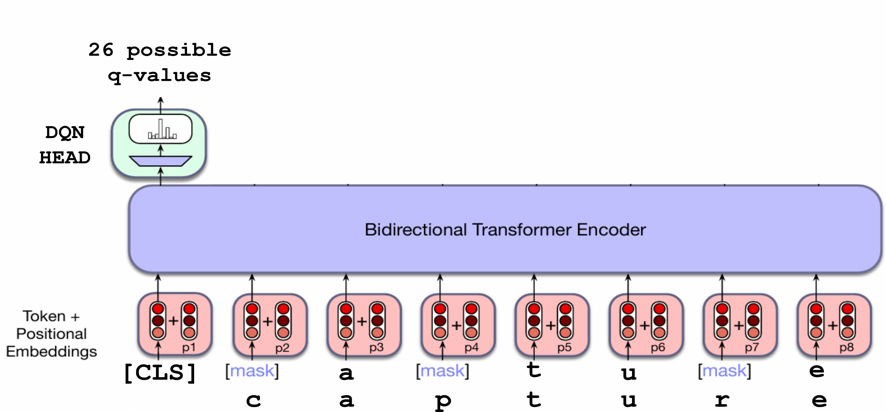

# Pretrained RL-Hangman

This projects proposes to solve the Hangman game by leveraging a pretrained-BERT model into a DQN algorithm. 

In my previous experiments, I try the suitabily of finetuning BERT model for learning to play the Hangman game using a Character-Level Masked Language Modeling (MLM) objective for token classification. You can check the project here: [Hangman BERT](https://github.com/ZosoV/hangman_bert). Although the result were promising getting an accuracy around 70% in the evaluation dataset, there was still open a door for more improvements. 

In such way, I propose an approach to leverage the previous finetuned-BERT model in a reinforcement learning loop. This proposal is fundamented in the following observation. Although the finetuned BERT model worked for playing the Hangman, this approach has one importatnt limitation, which is that it doesn't consider that inherint decision making task that the problem of Hangman game has. It only adapts the biderectional contextual mechanism for training BERT in order to use it to play the Hangman game. However, the game itself has decision making nature, which should be address more efficiently. In this context and in oder to address this issue, we employ a DQN algorithm using a pretrained-BERT model as backbone to be finetuned. The idea is that the pre-trained BERT should contain enough information and capacity to understand the context between characters, while the DQN algorithm will confer the decision makind capabilities to take decision more efficiently in different escenarios. To the best of my knowledge this is the first algorithm that tries to do this.

## Reward Function

One of the main parts of the design of this reinforcement learning approach was the design of a efficient reward function which should have to target the needs for the specific task of learning to play the Hangman game. The rewards are assignated as follows

- The agent receives a reward of 50 when it completes the game successfully and discover the whole words
- The agent recieves a penalty of -5 when it makes a mistakes and he loss a life. Notice the agent only has 6 possible lives
- The agent receives a penalty of -2 if it guess a letter that was already assignated, but it doesn't loss a life.
- The agent receives a reward of 10 when it guess one letter correctly plus a bonus given by relative and global frequencies gotten from a training dataset that contains around 250k common words.

**Bonus System**
The idea of the bonus system is confer reward or penalties that aligns with how a human solving the Hangman will act according the situation that he can encounter during the game. For example:

1. In the initial part of the game, as all the letters are hidden, a human will try to guess the letter with more global frequency, which commonly are given by the vocals a, e, i, o, u. Then, we provide more reward if the guessed letter coincides with the letter.

2. However, in the last part of the game, a human should change their strategy because he now has more letters and context to guess the words. In those escenarios, instead of looking to global frequencies, we look to relative frequency based on the current pattern of the word.  
    - Specifically, from the reference training dataset, we filter the words that coincides with the current pattern of the word (e.g _ i g _ _ coincides with tiger and fight). Then, we calculate the letter frequencies relative to this subset of words; and the letter with more frequency receives a higher bonus.

All this process is controlled by a ratio value that weights the bonus by taking into account how earlier or late the agent is in the game, as is given as follows:

$$\text{ratio} = \frac{\text{num hidden letters}}{\text{word length}}$$

$$\text{bonus} = \text{global reward} * \text{ratio} + \text{relative reward} * (1 - \text{ratio})$$

### Content
- A initial cleaning of data was performed on [DataExploration.ipynb](DataExploration.ipynb), where among other things the data was filter according the length and rare cases that will not be possible, or will be easier to guess.
- The pretrained bert was developed using HuggingFace and Pytorch Library on scripts [utils_dataset.py](utils_dataset.py), [trainer.py](trainer.py), [train_pretrained_bert.py](train_pretrained_bert.py), and [utils_model.py](utils_model.py),
- The DQN algorithm was developed using TorchRL and Pytorch Library on scripts [dqn.py](dqn.py) and [utils_dqn.py](utils_dqn.py).
- A customized OpenGym environment was created using the training dataset on [./custom_env/hangman_env.py](./custom_env/hangman_env.py)

### Ablation Study

I perform several experiments to adjust the environment and reward, the architecture, the hyperparameters, etc. Among the more relevant ablation studies that I perform are the following:

- Add additional bigram and trigram bonus. Specifically, I took the most frequent bigrams and trigrams in my dataset and if the agent guess leads to one of this bigrams or tigrams I assign an additional reward bonus. However, the results were not quite distinct that the ones without using the mechanism.
- I tried different architectures for the BERT model. The original BERT is huge and produce long lasting iterations. For that reason, I try different techniques:
    1. I use Low Rank Adaptation (LoRA) in the original BERT model. Although now not all the weights were updated, the forward pass is still very expensive in terms of computational resource, which lead too long lasting iterations.
    2. I used small and tiny variations of the original BERT. The pretrained BERT small is still very expensive, so by adding Low Rank Adaptation (LoRA), we reduce the updating steps. Then, the tiny BERT variant was tested getting similar results as small BERT with LoRA. We decided to use the tiny without any freezing or LoRA to give more opportunity to the model to learn the patterns.
- The hyperparameters to finetuneed the pretrained BERT where set following the original standars in the paper BERT except for the learning rate that we decided to provide a customized scheduler more simple due to our task now is more simple.
- The hyperparameters for the DQN algorithm were set according standard in atari games. However, we realize we have opportunity to increase learning by increase the batch sizes and given a large buffer size. Also we realize the importance of keep at least some value of randomness with the epsilon value due to the problem it self can find different escenarios where more than one guess could be valid.

### Conclusion and Future words

The inclusion of a pretrained BERT model into the DQN algorithm allow us to deal with decision makind capabilities of the problem by increasing the accuracy from  70% to 75% over the same evaluation test. Now, we even can evalutate our model in actual games of Hangman games without requiring a surrogate metric as in [Hangman BERT](https://github.com/ZosoV/hangman_bert). Here, we got sucessful games result in around 81% of 113000 games played.

- Implement a simple initial rule of guessing one or two vocals (based on the frequencies) depending on the length of the word and just allowing one mistakes.
- Instead of only training for the DQN objective, mix both objectives. Training for both the DQN objective and character MLM, to avoid catastrophic forgetting.
- Try a RL algorithm that works in an stochastic way not deterministic over the DQN values because in many cases or games we can guess some letters a come up with a pattern that is valid to several other words. In those cases the decision are more stochastic than deterministic.
